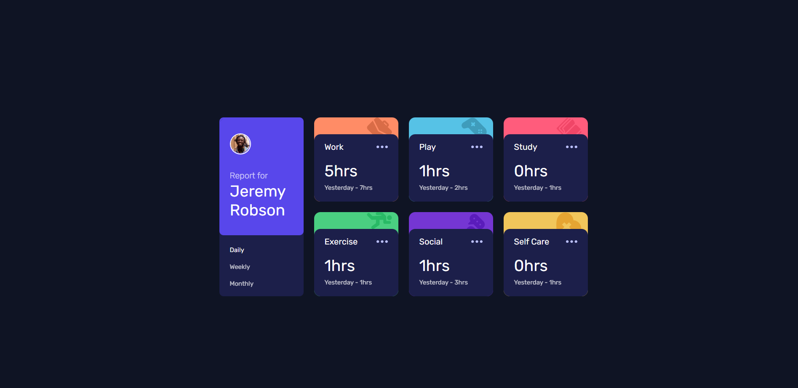

# Frontend Mentor - Time tracking dashboard solution

This is a solution to the [Time tracking dashboard challenge on Frontend Mentor](https://www.frontendmentor.io/challenges/time-tracking-dashboard-UIQ7167Jw). Frontend Mentor challenges help you improve your coding skills by building realistic projects. 

## Table of contents

- [Frontend Mentor - Time tracking dashboard solution](#frontend-mentor---time-tracking-dashboard-solution)
  - [Table of contents](#table-of-contents)
  - [Overview](#overview)
    - [The challenge](#the-challenge)
    - [Screenshot](#screenshot)
    - [Links](#links)
  - [My process](#my-process)
    - [Built with](#built-with)
    - [What I learned](#what-i-learned)
    - [Continued development](#continued-development)
    - [Useful resources](#useful-resources)
  - [Author](#author)

## Overview

### The challenge

Users should be able to:

- View the optimal layout for the site depending on their device's screen size
- See hover states for all interactive elements on the page
- Switch between viewing Daily, Weekly, and Monthly stats

### Screenshot

### Links

- [Solution URl](https://github.com/akash-Sa19/time-tracking-dashbord)
- [Live Site URL](https://akash-sa19.github.io/time-tracking-dashbord/)

## My process
- `Mobile-First Workflow ` I designed for small screen devices first
- then for desktop and other screen devices, with adding reponsiveness to the site 
- after the layout is ready i started styling the website with colors, fonts, icons, images etc  
- then add javascript logic or hover and data manupulation
### Built with

- Semantic HTML5 markup
- CSS custom properties
- Flexbox
- CSS Grid
- Mobile-first workflow
- Tailwindcss

### What I learned
From this challenge I learned how to properly use flex-box, flex-box is very usefull when you want to make a website responsive  

### Continued development

I am little weak at logic when it comes to JavaScript, i want to improve that by making more and more website. 

### Useful resources

- [Tailwind CSS](https://tailwindcss.com/) - I used CSS framework TailwindCSS for this project. this framework reduces the hard-work by styling the content right on the line by using classes.
- [Fontawesome](https://fontawesome.com/) - This website for have a large collection of free to use icons, fonts, which anyone can add to there website.

## Author

- Website - [Akash Sahu](https://www.your-site.com)
- Frontend Mentor - [@akash-sa19](https://www.frontendmentor.io/profile/akash-Sa19)
- Twitter - [@AkashSa71312006](https://www.twitter.com/AkashSa713120006)
- Linkdin - [@akash-sahu](https://www.linkedin.com/in/akash-sahu-4b4615220/)

